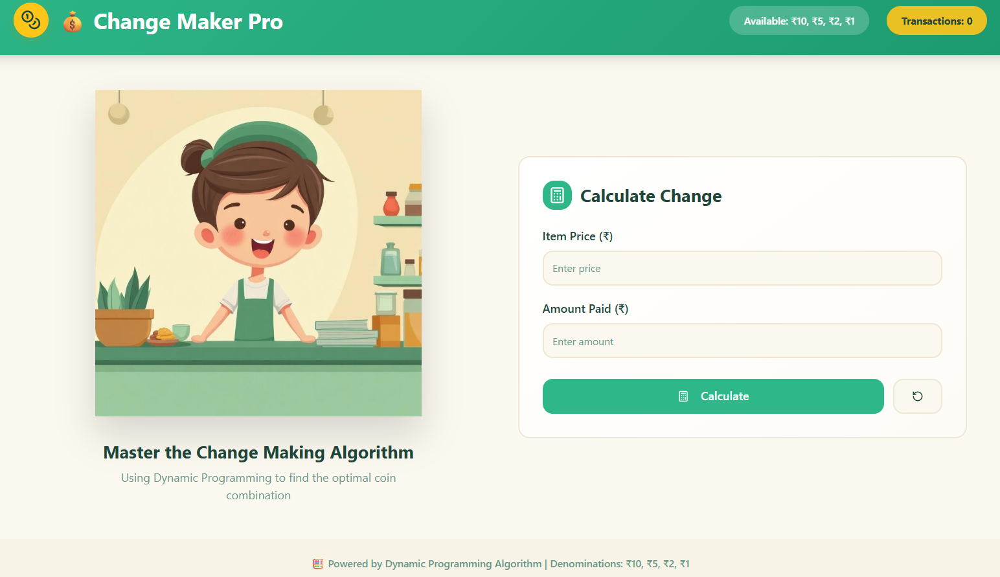
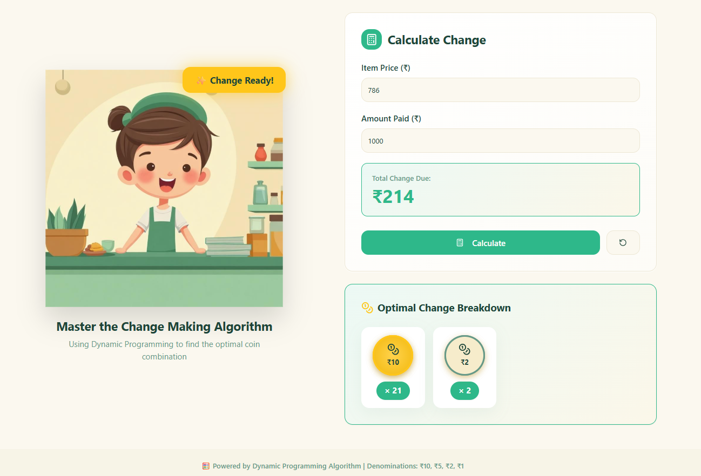

# 💰 Change Maker Game – Greedy Algorithm | ADA Project

> An interactive **Change Making Problem** implementation using the **Greedy Algorithm**, built as an **ADA (Analysis and Design of Algorithms) project** for **Semester 5 Computer Engineering**.

This project demonstrates how the **greedy approach** is applied to solve the classic **change-making problem**, a fundamental topic in **Data Structures and Algorithms (DSA)**.

---

## 📘 Project Overview

The **Change Maker Game** is a web-based academic project that calculates the **minimum number of coins or notes** required to make a given amount using the **Greedy Algorithm**.

Instead of limiting the learning to theory, this project:
- Implements the greedy algorithm in real code  
- Shows how algorithm logic works step by step  
- Makes ADA concepts easier to understand through UI  

This repository is useful for students searching for:
> *change making problem greedy algorithm*,  
> *ADA project for computer engineering*,  
> *greedy algorithm implementation*,  
> *DSA mini project*,  
> *algorithm visualization project*.

---
## 🖼️ Project Preview

Below are some previews of the **Change Maker Game** interface and output, showing how the greedy algorithm works in practice.

### 🔹 Main Interface

### 🔹 Greedy Algorithm Output

---

## 🧠 Algorithm Used – Greedy Algorithm

### 🔹 Change Making Problem
The **Change Making Problem** is a classic problem in **algorithm design**, where the goal is to make a target amount using the **minimum number of coins** from a given set of denominations.

### 🔹 Why Greedy Algorithm?
The greedy algorithm:
- Selects the **largest denomination first**
- Reduces the remaining amount iteratively
- Produces optimal results for standard currency systems

This project demonstrates:
- Greedy choice property  
- Optimal substructure  
- Time-efficient algorithm design  

These concepts are core topics in **ADA**, **DSA**, and **algorithm analysis**.

---

## 🎯 Key Features

- Interactive change-making game  
- Greedy algorithm implementation  
- Minimum coin calculation logic  
- Clean and responsive UI  
- Real-time output generation  
- Beginner-friendly algorithm demonstration  

---

## 🛠 Tech Stack Used

This project is built using a modern frontend stack:

- **Vite** – Fast frontend tooling  
- **React** – Component-based UI development  
- **TypeScript** – Type-safe JavaScript  
- **Tailwind CSS** – Utility-first styling  
- **PostCSS** – CSS processing  
- **ESLint** – Code quality and consistency  

This combination makes the project both **academically strong** and **industry-aligned**.

---

## 🎓 Academic Details

- **Subject:** Analysis and Design of Algorithms (ADA)  
- **Semester:** 5  
- **Branch:** Computer Engineering  
- **Topic:** Change Making Problem using Greedy Algorithm  
- **Category:** DSA / Algorithm Mini Project  

This repository is suitable for:
- ADA practical submission  
- Viva preparation  
- College mini-project reference  
- Algorithm demonstration  

---

## 🌱 Learning Outcomes

By exploring this project, learners will:
- Understand greedy algorithms practically  
- Learn how to implement DSA concepts in real applications  
- Visualize algorithm decisions instead of memorizing theory  
- Connect frontend development with algorithm logic  

---

## ⚠️ Limitations

- Greedy algorithm does not guarantee optimal results for all coin systems  
- Designed primarily for academic and learning purposes  
- Uses predefined denominations  

---

## 🔮 Future Scope & Improvements

- Comparison with **Dynamic Programming** approach  
- Step-by-step greedy decision visualization  
- Custom denomination input  
- Time and space complexity analysis  
- Animation-based algorithm explanation  

---

## 📌 Keywords for Search Optimization

**Change Making Problem**, **Greedy Algorithm**, **ADA Project**,  
**Analysis and Design of Algorithms**, **DSA Project**,  
**Computer Engineering Mini Project**, **Greedy Algorithm Implementation**,  
**Algorithm Visualization**, **Semester 5 ADA Project**,  
**Vite React TypeScript Project**

---

## 📌 Final Note

This project is created for **educational and academic purposes**, focusing on **algorithm understanding rather than just results**.

If you are learning **ADA, DSA, or Greedy Algorithms**, this project will help you connect **theory with practice**.

**Learn algorithms by building them. 🚀**
